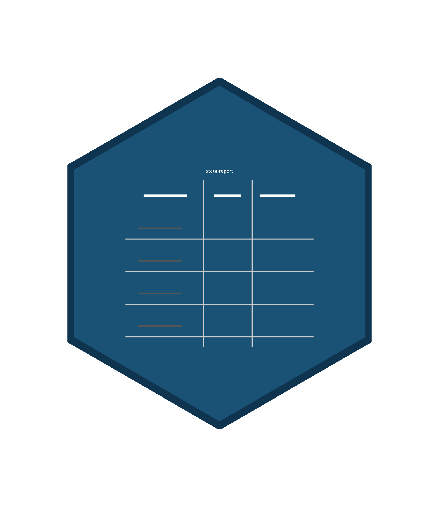

<p align="center">
  
</p>

<h1 align="center">statareport</h1>

<p align="center">
  <em>A Stata package for automated Stata-to-Word reporting.</em><br>
  Go from empty folder to rendered <code>.docx</code> with a single
  <code>statareport_render</code>.
</p>

<p align="center">
  <a href="https://epicentre-msf.github.io/statareport/"><b>📖 Documentation</b></a> ·
  <a href="https://epicentre-msf.github.io/statareport/tutorial/"><b>🚀 Tutorial</b></a> ·
  <a href="https://epicentre-msf.github.io/statareport/commands/"><b>⚙️ Commands</b></a> ·
  <a href="https://epicentre-msf.github.io/statareport/changelog/"><b>🗒 Changelog</b></a>
</p>

---

## What it is

`statareport` stitches together publication-ready table commands
(`quant`, `qual`, `kable`), a project scaffold
(`statareport_init_project`), a configuration loader
(`.StataEnviron`), and a Pandoc-driven render pipeline
(`create_dyntex` → `dyntext` → `knit`) into a single convention-based
workflow. Every clinical-trial report we ship runs through it.

The full hosted documentation is at
**<https://epicentre-msf.github.io/statareport/>** — this README is a
quick-start plus an index of what lives where.

---

## Install

```stata
net install statareport, from("https://raw.githubusercontent.com/epicentre-msf/statareport/main/") replace
```

Requires Stata 15+ and [Pandoc](https://pandoc.org/) on `PATH`. See
[the docs](https://epicentre-msf.github.io/statareport/install/) for local-path
and subfolder variations.

---

## From empty folder to `.docx` in 60 seconds

```stata
cd ~/scratch/my_trial
! touch .here                              // marker file for `here`
here

statareport_init_project, prefix("MyTrial") ///
    title("My trial") author("Me") listoftables listoffigures
```

You now have:

```
my_trial/
├── .here
├── .StataEnviron.example                  ← copy to .StataEnviron for local paths
├── do_files/
│   ├── 00-final-do-file.do                ← populated master
│   ├── 01-create-datasets.do              ← you fill these in
│   └── …
├── input_md/                              ← pandoc resources ready to go
├── input_tables/                          ← Excel caption + shift-graph templates
├── output_md/, output_tables/, output_figures/, output_word/
├── local_datasets/
└── logs/
```

Edit `do_files/00-final-do-file.do` to register your datasets, then:

```stata
do do_files/00-final-do-file.do
```

The tail runs `statareport_render`, which calls `create_dyntex` →
`dyntext` → `knit` and drops a Word document in `output_word/`. Every
regeneration is one command.

[Full walk-through →](https://epicentre-msf.github.io/statareport/tutorial/)

---

## The master do-file

`statareport_init_project` writes a ~100-line
`do_files/00-final-do-file.do` organised in seven sections:

```stata
* 1. Project root
here

* 2. Machine-specific paths from .StataEnviron
statareport_load_env, quiet

* 3. Directory globals ($dir_*)
statareport_add_dir, name(dofiles)   path("do_files")
statareport_add_dir, name(input_md)  path("input_md")
statareport_add_dir, name(tables)    path("output_tables")
statareport_add_dir, name(lbltables) path("labelled_tables") parent(tables) mkdir
statareport_add_dir, name(figures)   path("output_figures")

* 4. Program directories (adopath)
statareport_add_programs programs extras

* 5. Report file paths and datasets
statareport_set_paths, prefix("MyTrial") date("$date_export")
statareport_set_paths, prefix("MyTrial") date("$date_export") variant("listings")

statareport_set_data_root, path("$dir_datasets")
statareport_add_data, name(preselection) path("preselection_visit.dta")
statareport_add_data, name(demo)         path("demog.dta")
statareport_add_data, name(meddra) path("$dir_onedrive/Meddra/codes.dta") raw
statareport_add_data, name(local_core) path("local_datasets/core.dta") project optional
statareport_confirm_data, ignore(local_core)

* 6. Analysis
reportdo 01-create-datasets
reportdo 02-patients-dispositions
reportdo 03-baseline
reportdo 06-safety

* 7. Render
statareport_render
```

See
[Workflow overview](https://epicentre-msf.github.io/statareport/workflow/)
for what each command does and
[Rendering pipeline](https://epicentre-msf.github.io/statareport/rendering/)
for the `knit` YAML mapping.

---

## Command reference (short)

| Category | Commands |
|----------|----------|
| **Scaffolding** | [here](https://epicentre-msf.github.io/statareport/commands/here/) · [statareport_init_project](https://epicentre-msf.github.io/statareport/commands/statareport_init_project/) · [statareport_setup_dirs](https://epicentre-msf.github.io/statareport/commands/statareport_setup_dirs/) · [statareport_load_env](https://epicentre-msf.github.io/statareport/commands/statareport_load_env/) |
| **Globals** | [statareport_add_dir](https://epicentre-msf.github.io/statareport/commands/statareport_add_dir/) · [statareport_add_programs](https://epicentre-msf.github.io/statareport/commands/statareport_add_programs/) · [statareport_set_paths](https://epicentre-msf.github.io/statareport/commands/statareport_set_paths/) · [statareport_set_data_root](https://epicentre-msf.github.io/statareport/commands/statareport_set_data_root/) · [statareport_add_data](https://epicentre-msf.github.io/statareport/commands/statareport_add_data/) · [statareport_confirm_data](https://epicentre-msf.github.io/statareport/commands/statareport_confirm_data/) · [lastexport](https://epicentre-msf.github.io/statareport/commands/lastexport/) |
| **Analysis** | [quant](https://epicentre-msf.github.io/statareport/commands/quant/) · [qual](https://epicentre-msf.github.io/statareport/commands/qual/) · [add_perc](https://epicentre-msf.github.io/statareport/commands/add_perc/) · [compute_ci](https://epicentre-msf.github.io/statareport/commands/compute_ci/) · [compute_shift_graphs](https://epicentre-msf.github.io/statareport/commands/compute_shift_graphs/) · [label_table](https://epicentre-msf.github.io/statareport/commands/label_table/) · [convert_wisely](https://epicentre-msf.github.io/statareport/commands/convert_wisely/) · [generate_label_ids](https://epicentre-msf.github.io/statareport/commands/generate_label_ids/) |
| **Rendering** | [statareport_render](https://epicentre-msf.github.io/statareport/commands/statareport_render/) · [statareport_write_header](https://epicentre-msf.github.io/statareport/commands/statareport_write_header/) · [create_dyntex](https://epicentre-msf.github.io/statareport/commands/create_dyntex/) · [kable](https://epicentre-msf.github.io/statareport/commands/kable/) · [kable_basic](https://epicentre-msf.github.io/statareport/commands/kable_basic/) · [knit](https://epicentre-msf.github.io/statareport/commands/knit/) · [reportdo](https://epicentre-msf.github.io/statareport/commands/reportdo/) |

Inside Stata, every command also has `help <name>` — the `.sthlp` files
are the single source of truth and the doc site is generated from them.

---

## Repository layout

```
statareport/
├── statareport.pkg              # package manifest used by `net install`
├── stata.toc                    # TOC for `net describe`
├── ado/                         # ado-programs + .sthlp help files
├── ressources/                  # shipped pandoc assets (Lua filters, docx, xlsx, …)
├── doc/                         # MkDocs Material documentation source
│   ├── mkdocs.yml
│   ├── build_commands.sh        # regenerates per-command pages from .sthlp
│   └── docs/
├── tools/smcl-vscode/           # optional VS Code extension for .sthlp editing
├── examples/                    # sample do-file and sample data
├── .github/workflows/docs.yml   # publishes doc/ to GitHub Pages on push
└── .local/                      # audit reports (gitignored)
```

---

## Development

```sh
git clone https://github.com/epicentre-msf/statareport
cd statareport

# Regenerate command pages from the .sthlp files:
bash doc/build_commands.sh

# Preview the doc site locally (needs mkdocs-material):
pip install mkdocs-material
mkdocs serve -f doc/mkdocs.yml
```

See
[Contributing](https://epicentre-msf.github.io/statareport/contributing/) for
the full development loop, style guide, and release process.

---

## License

MIT. © contributors.
