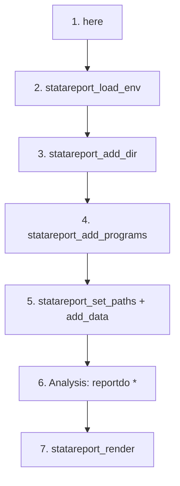

# Workflow overview

`statareport` is organised around a single master do-file
(`do_files/00-final-do-file.do`, generated by
[`statareport_init_project`](commands/statareport_init_project.md)).
Everything runs top-to-bottom in **seven sections**:



## 1. `here` — anchor the project root

```stata
here
```

Walks up from `c(pwd)` until it finds a marker file (`.here`, `.git`, or
`*.stpr`), `cd`'s there, and caches the path in the Mata global
`__here_root__`. Every subsequent statareport command reads this cache
— you never have to pass the project root around.

## 2. `statareport_load_env` — machine-specific paths

```stata
statareport_load_env, quiet
```

Reads `<project>/.StataEnviron` (a gitignored dotenv file) and sets
`$dir_onedrive`, `$dir_datasets`, and any other `KEY=VALUE` pair into
`$dir_<key>`. See [Configuration](configuration.md) for the full syntax.

## 3. `statareport_add_dir` — project directories

```stata
statareport_add_dir, name(dofiles)   path("do_files")
statareport_add_dir, name(input_md)  path("input_md")
statareport_add_dir, name(tables)    path("output_tables")
statareport_add_dir, name(lbltables) path("labelled_tables") parent(tables) mkdir
statareport_add_dir, name(figures)   path("output_figures")
```

Each call emits `$dir_<name>`. Resolution modes:

| Mode | Where relative paths resolve |
|------|------------------------------|
| *(default)* | `__here_root__` (project root) |
| `parent(n)` | `$dir_<n>` (a previously-registered sibling) |
| `root(p)` | explicit `p` for this one call |
| `raw` | no root — path used verbatim |

## 4. `statareport_add_programs` — adopath

```stata
statareport_add_programs programs extras
```

Any number of subdirectories relative to the project root, each appended
to the adopath (`adopath ++`). Pass `prepend` to use `adopath +` instead.

## 5. `statareport_set_paths` + dataset pool

```stata
local today: display %tdCCYYNNDD date(c(current_date), "DMY")
global date_export `today'

statareport_set_paths, prefix("MyTrial") date("$date_export")
statareport_set_paths, prefix("MyTrial") date("$date_export") variant("listings")

statareport_set_data_root, path("$dir_datasets")     // $dir_datasets comes from .StataEnviron

statareport_add_data, name(preselection) path("preselection_visit.dta")
statareport_add_data, name(demo)         path("demog.dta")
* …
statareport_add_data, name(meddra) path("$dir_onedrive/Meddra/meddra_codes.dta") raw
statareport_add_data, name(local_core) path("local_datasets/core.dta") project optional

statareport_confirm_data, ignore(local_core)
```

`statareport_set_paths` emits the full `$file_*` family from a single
prefix/date. Datasets registered by `statareport_add_data` each get a
`confirm file` check; missing files are warnings unless `optional` is
specified.

## 6. Analysis — `reportdo`

```stata
reportdo 01-create-datasets
reportdo 02-patients-dispositions
reportdo 03-baseline
* reportdo 04-adherence
* reportdo 05-efficacy
reportdo 06-safety
* reportdo 07-listings
```

`reportdo <name>` resolves `<name>` against `$dir_dofiles`, appends
`.do` if missing, and runs it. Supports subdirectories
(`reportdo helpers/make_cohort`) and extra args via `args()`.

## 7. Rendering — `statareport_render`

```stata
global var_sheet_lab "Labels"
global file_filters `""$dir_input_md/page-orientation.lua" "$dir_input_md/table-breaks.lua" "$dir_input_md/list-tables.lua""'

statareport_render
```

One call drives [`create_dyntex`](commands/create_dyntex.md) →
`dyntext` → [`knit`](commands/knit.md). See
[Rendering](rendering.md) for the full YAML mapping and customization
knobs.

## Regenerating the docx

Every rebuild of the report is a single command:

```stata
do do_files/00-final-do-file.do
```

Changes to step do-files are picked up automatically. Changes to
`tables_labels.xlsx` (captions) are picked up by `create_dyntex` without
any other action.
